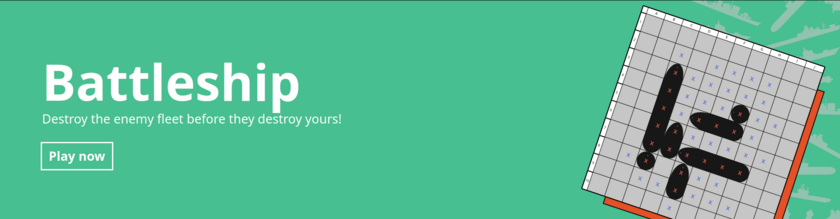
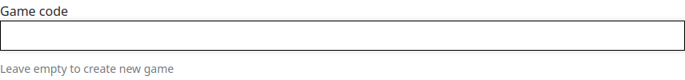
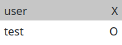

<p align="center">
  
</p>
<h1 align="center">Asobi</h1>
<p align="center">
  A web application with real-time multiplayer board games
</p>

## Description
Asobi is a web application where you can play popular board games with your
friends and family! Available games include:

<p align="center">
  
</p>
<p align="center">
  
</p>
<p align="center">
  
</p>
<p align="center">
  
</p>
<p align="center">
  
</p>
<p align="center">
  
</p>

## Tools used
- Django
- Django channels (with Redis channel layer backend)
- Django REST Framework
- Bootstrap CSS
- JQuery
- React JS
- Webpack with Babel

## How to play
An account is needed to play any game.
Login to your account and select the game you want to play.
There will be an option to enter a game code.
If you want to create a new game, click on Join Game without entering a game
code.



If you want to join a game that has been created already, either enter the 16
character game code or scan the QR code provided to the game creator.


The game creator gets the first turn in every game. In games with more than two
players, the turn order is the same as the order in which players joined the
game. If you want to change the order of turns, just create a new game.

The current turn is indicated in every game with highlighted username.
The colors/symbols of each player is also indicated at the same place.



After a game is over, all the participating players get an option to reset the
board. The option is always available even if you visit the game later.

Rules specific to games have been listed on their respective pages.

## Database
Asobi currently uses PostgreSQL but is also compatible with SQLite 3.35+ and
MariaDB 10.5+. Other databases are not supported due to the use of
[`bulk_create`](https://docs.djangoproject.com/en/4.0/ref/models/querysets/#bulk-create)
while creating some objects.

For running locally, it is suggested to use SQLite because it makes things
easier. To do so, edit the file `asobi/settings.py` by uncommenting the
top `'default'` block and commenting the bottom one:
```python
DATABASES = {
    # 'default': {
    #     'ENGINE': 'django.db.backends.sqlite3',
    #     'NAME': os.path.join(BASE_DIR, 'db.sqlite3'),
    # }
    'default': {
        'ENGINE': 'django.db.backends.postgresql',
        'OPTIONS': {
            'service': 'asobi_service',
            'passfile': '.pgpass',
        },
    }
}
```
After editing, the lines should look like this:
```python
DATABASES = {
    'default': {
        'ENGINE': 'django.db.backends.sqlite3',
        'NAME': os.path.join(BASE_DIR, 'db.sqlite3'),
    }
    # 'default': {
    #     'ENGINE': 'django.db.backends.postgresql',
    #     'OPTIONS': {
    #         'service': 'asobi_service',
    #         'passfile': '.pgpass',
    #     },
    # }
}
```
After this is done, you can run the commands in the
[Running locally](#running-locally) section to run the application on your
machine.

## Running locally
Clone the repository and make edits as shown in [Database](#database) section.
After doing that, run the following commands in the `asobi` root directory:
```bash
npm install
./node_modules/.bin/webpack --config webpack.config.js
pip install -r requirements.txt
echo "SECRET_KEY=$(openssl rand 60 | openssl base64 -A)" > .env
python manage.py makemigrations
python manage.py migrate --run-syncdb
python manage.py runserver
```
