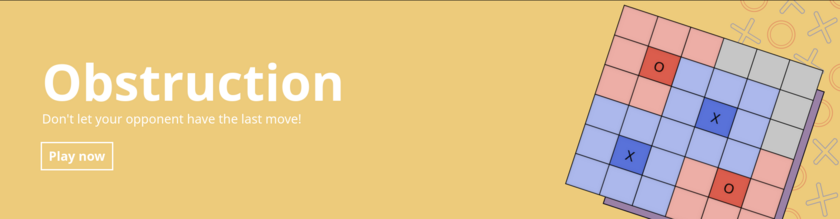

<p align="center">
  
  <br>
  <a href="https://asobi-46md.onrender.com"></a>
</p>
<h1 align="center">Asobi</h1>
<p align="center">
  A web application with real-time multiplayer board games
</p>

## Description
Asobi is a web application where you can play popular board games with your
friends and family! Available games include:

<p align="center">
  
</p>
<p align="center">
  
</p>
<p align="center">
  
</p>
<p align="center">
  
</p>
<p align="center">
  
</p>
<p align="center">
  
</p>

## Tools used
- Django
- Django channels (with Redis channel layer backend)
- Django REST Framework
- Bootstrap CSS
- JQuery
- React JS
- Webpack with Babel

## Demo deployment
A demo instance has been deployed to [Render](https://asobi-46md.onrender.com).

>:warning: Databases on supabase are paused after a week of inactivity. If you get a
>500 Server Error during login, it's because the database might be paused. Ping me here
>and I'll unpause it.

## How to play
An account is needed to play any game.
Login to your account and select the game you want to play.
There will be an option to enter a game code.
If you want to create a new game, click on Join Game without entering a game
code.


If you want to join a game that has been created already, either enter the 16
character game code or scan the QR code provided to the game creator.


The game creator gets the first turn in every game. In games with more than two
players, the turn order is the same as the order in which players joined the
game. If you want to change the order of turns, just create a new game.

The current turn is indicated in every game with highlighted username.
The colors/symbols of each player is also indicated at the same place.


After a game is over, all the participating players get an option to reset the
board. The option is always available even if you visit the game later.

Rules specific to games have been listed on their respective pages.

## Database
Asobi currently uses PostgreSQL from Supabase for Render deployment but is also
compatible with SQLite 3.35+ and MariaDB 10.5+. Other databases are not
supported due to the use of
[`bulk_create`](https://docs.djangoproject.com/en/4.0/ref/models/querysets/#bulk-create)
while creating some objects.

For running locally, it uses SQLite because it makes things easier to setup.

To use postgres while running locally, make the following changes to
`asobi/settings.py`. Comment the upper `default` key and uncomment the lower
`default` key. So the following code
```python
DATABASES = {
    'default': {
        'ENGINE': 'django.db.backends.sqlite3',
        'NAME': os.path.join(BASE_DIR, 'db.sqlite3'),
    }
    # 'default': {
    #     'ENGINE': 'django.db.backends.postgresql',
    #     'OPTIONS': {
    #         'service': 'asobi_service',
    #         'passfile': '.pgpass',
    #     },
    # }
}
```
changes to
```python
DATABASES = {
    # 'default': {
    #     'ENGINE': 'django.db.backends.sqlite3',
    #     'NAME': os.path.join(BASE_DIR, 'db.sqlite3'),
    # }
    'default': {
        'ENGINE': 'django.db.backends.postgresql',
        'OPTIONS': {
            'service': 'asobi_service',
            'passfile': '.pgpass',
        },
    }
}
```
You can remove the sqlite `default` key as well if you're sure that you're
going to be using postgres.

## Secret key
You need to set a `SECRET_KEY` as an environment variable or in your `.env`
file.
```bash
echo "SECRET_KEY=$(openssl rand 60 | openssl base64 -A)" > .env
```

## Redis
Asobi uses Redis channel layer by default. You need to have a running local
redis instance.
If you need to use a remote redis server, you can set `$REDIS_HOST`
to the host url as an environment variable or in your `.env` file.
```
REDIS_HOST='redis://:password@hostname:port/0'
```
For Render deployment, a Redis instance provided by Render is used.

## Running locally
Clone the repository and setup the `.env` file as per the
[Secret key](#secret-key) section.

Setup a local Redis instance or add a remote host as per [Redis](#redis)
section.

**Note**: Asobi uses `wss://` for websockets by default (for Render).
For running locally, use `ws://`. To do so, run the following command in
the `templates/components` directory.
```bash
grep -rl "wss:" . | xargs sed -i "s/wss:/ws:/g"
```

After doing that, run the following commands in the `asobi` root directory:
```bash
npm install
npm run build
pip install -r requirements.txt
python manage.py makemigrations
python manage.py migrate --run-syncdb
```
Then run the server with:
```
python manage.py runserver 0.0.0.0:$PORT
```
or
```
daphne -b 0.0.0.0 -p $PORT asobi.asgi:application
```
